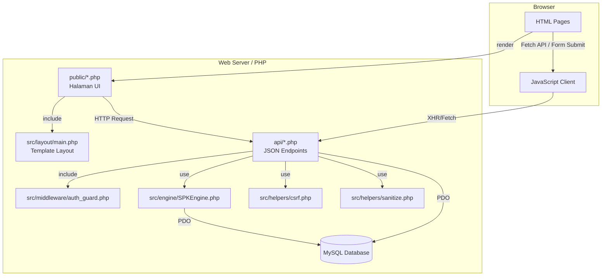
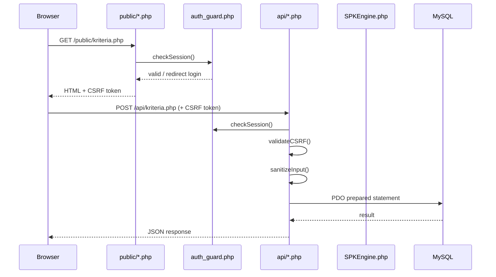

# Design Document: SPK Website (Sistem Pendukung Keputusan)

## Overview

SPK Website adalah aplikasi web multi-halaman yang mengimplementasikan metode SAW (Simple Additive Weighting) untuk pengambilan keputusan multi-kriteria. Sistem ini memungkinkan Admin mendefinisikan kriteria dan alternatif, menjalankan perhitungan SAW, serta melihat dan mengunduh hasil perankingan.

### Tujuan Desain

- Menyediakan antarmuka yang intuitif untuk manajemen data kriteria dan alternatif
- Mengimplementasikan algoritma SAW yang akurat dan terverifikasi
- Memastikan keamanan data melalui autentikasi sesi, CSRF protection, dan prepared statements
- Menghasilkan laporan PDF yang dapat diunduh dan visualisasi grafik interaktif
- Mendukung tampilan responsif dari lebar layar 320px ke atas

### Batasan Teknis

- Backend: PHP 8.x + MySQL 8.x dengan PDO
- Frontend: HTML5, CSS, JavaScript (ES6+), Tailwind CSS via CDN
- Arsitektur: Multi-page application (MPA) dengan PHP pages + JSON API endpoints
- Library eksternal: TCPDF/mPDF (PDF), Chart.js via CDN (grafik)
- Tidak ada framework PHP (Laravel, Symfony) — PHP murni dengan struktur direktori terorganisir

---

## Architecture

### Arsitektur Sistem

Sistem menggunakan arsitektur MPA (Multi-Page Application) dengan pemisahan yang jelas antara lapisan presentasi (PHP pages), lapisan API (JSON endpoints), dan lapisan bisnis (PHP classes).



### Alur Request



### Struktur Direktori

```
spk-website/
├── public/                  # Halaman PHP yang dapat diakses browser
│   ├── index.php            # Redirect ke login atau dashboard
│   ├── login.php
│   ├── dashboard.php
│   ├── kriteria.php
│   ├── alternatif.php
│   ├── hitung.php
│   ├── hasil.php
│   ├── riwayat.php
│   └── pengaturan.php
├── api/                     # JSON API endpoints
│   ├── auth.php
│   ├── logout.php
│   ├── dashboard.php
│   ├── kriteria.php
│   ├── alternatif.php
│   ├── hitung.php
│   ├── laporan.php
│   └── pengaturan.php
├── src/                     # Kelas dan helper PHP
│   ├── engine/
│   │   └── SPKEngine.php
│   ├── middleware/
│   │   └── auth_guard.php
│   ├── helpers/
│   │   ├── csrf.php
│   │   └── sanitize.php
│   └── layout/
│       └── main.php
├── config/
│   └── database.php         # Konfigurasi koneksi PDO
├── database/
│   └── schema.sql           # Skema database yang dapat dijalankan ulang
├── assets/
│   ├── css/                 # CSS tambahan (minimal)
│   ├── js/                  # JavaScript client-side
│   └── uploads/             # Logo yang diupload
└── tests/                   # Unit dan integration tests
    ├── unit/
    └── integration/
```

---

## Components and Interfaces

### 1. SPKEngine (`src/engine/SPKEngine.php`)

Komponen inti yang mengimplementasikan algoritma SAW. Dirancang sebagai pure class tanpa side effects — tidak melakukan query database secara langsung.

```php
class SPKEngine {
    /**
     * Normalisasi matriks keputusan per kriteria.
     * Benefit: nilai / max(nilai)
     * Cost:    min(nilai) / nilai
     *
     * @param array $values  Array nilai alternatif untuk satu kriteria [alt_id => nilai]
     * @param string $type   'benefit' atau 'cost'
     * @return array         Array nilai ternormalisasi [alt_id => nilai_normal]
     */
    public function normalize(array $values, string $type): array;

    /**
     * Hitung nilai preferensi setiap alternatif.
     * V_i = sum(w_j * r_ij) untuk semua j
     *
     * @param array $normalizedMatrix  [kriteria_id => [alt_id => nilai_normal]]
     * @param array $weights           [kriteria_id => bobot]
     * @return array                   [alt_id => nilai_preferensi]
     */
    public function calculatePreference(array $normalizedMatrix, array $weights): array;

    /**
     * Urutkan alternatif dari nilai preferensi tertinggi ke terendah.
     *
     * @param array $preferences  [alt_id => nilai_preferensi]
     * @return array              Array terurut: [['id' => alt_id, 'preference' => nilai, 'rank' => posisi], ...]
     */
    public function rank(array $preferences): array;
}
```

**Keputusan Desain**: SPKEngine dibuat sebagai pure class (tanpa dependency ke database) agar mudah diuji secara unit. API endpoint `api/hitung.php` bertanggung jawab mengambil data dari database, memanggil SPKEngine, dan menyimpan hasilnya.

### 2. Auth Guard (`src/middleware/auth_guard.php`)

```php
/**
 * Validasi sesi aktif. Jika tidak valid:
 * - Untuk request HTML: redirect ke /public/login.php
 * - Untuk request API (Accept: application/json): return HTTP 401
 */
function requireAuth(): void;

/**
 * Perbarui timestamp aktivitas sesi terakhir.
 * Dipanggil di setiap request yang terautentikasi.
 */
function refreshSession(): void;

/**
 * Cek apakah sesi sudah kedaluwarsa (> 60 menit tidak aktif).
 */
function isSessionExpired(): bool;
```

### 3. CSRF Helper (`src/helpers/csrf.php`)

```php
/**
 * Generate token CSRF baru dan simpan ke sesi.
 * @return string Token CSRF (hex string 32 karakter)
 */
function generateCsrfToken(): string;

/**
 * Validasi token CSRF dari request.
 * @param string $token Token dari form/header
 * @return bool
 */
function validateCsrfToken(string $token): bool;
```

### 4. Sanitize Helper (`src/helpers/sanitize.php`)

```php
/**
 * Sanitasi string input untuk mencegah XSS.
 * Menggunakan htmlspecialchars() dengan ENT_QUOTES.
 */
function sanitizeString(string $input): string;

/**
 * Validasi dan sanitasi nilai numerik.
 * @return float|false
 */
function sanitizeNumeric(mixed $input): float|false;

/**
 * Sanitasi array input secara rekursif.
 */
function sanitizeArray(array $input): array;
```

### 5. API Endpoints

Semua endpoint mengembalikan JSON dengan format standar:

```json
// Sukses
{ "success": true, "data": { ... } }

// Error
{ "success": false, "message": "Pesan error yang dapat ditampilkan ke user" }
```

| Endpoint | Method | Deskripsi |
|---|---|---|
| `api/auth.php` | POST | Login: verifikasi kredensial, buat sesi |
| `api/logout.php` | POST | Hapus sesi, redirect ke login |
| `api/dashboard.php` | GET | Ringkasan data (jumlah kriteria, alternatif, tanggal hitung terakhir) |
| `api/kriteria.php` | GET/POST/PUT/DELETE | CRUD kriteria |
| `api/alternatif.php` | GET/POST/PUT/DELETE | CRUD alternatif beserta nilai kriteria |
| `api/hitung.php` | POST | Jalankan perhitungan SAW, simpan hasil |
| `api/laporan.php` | GET | Generate dan download PDF laporan |
| `api/pengaturan.php` | GET/POST | Ambil/simpan pengaturan sistem |

### 6. Frontend Pages

Setiap halaman PHP di `public/` mengikuti pola:

```php
<?php
require_once '../src/middleware/auth_guard.php';
requireAuth();
$csrfToken = generateCsrfToken();
require_once '../src/layout/main.php'; // render header + sidebar
?>
<!-- Konten halaman -->
<script>
// JavaScript untuk fetch API dan interaksi UI
const CSRF_TOKEN = '<?= $csrfToken ?>';
</script>
```

---

## Data Models

### Skema Database MySQL

```sql
-- Tabel pengguna sistem
CREATE TABLE users (
    id          INT UNSIGNED AUTO_INCREMENT PRIMARY KEY,
    username    VARCHAR(50) NOT NULL UNIQUE,
    password    VARCHAR(255) NOT NULL,  -- bcrypt hash
    created_at  TIMESTAMP DEFAULT CURRENT_TIMESTAMP,
    updated_at  TIMESTAMP DEFAULT CURRENT_TIMESTAMP ON UPDATE CURRENT_TIMESTAMP
);

-- Tabel kriteria evaluasi
CREATE TABLE kriteria (
    id          INT UNSIGNED AUTO_INCREMENT PRIMARY KEY,
    nama        VARCHAR(100) NOT NULL UNIQUE,
    bobot       DECIMAL(5,4) NOT NULL,  -- 0.0001 – 1.0000
    tipe        ENUM('benefit', 'cost') NOT NULL,
    created_at  TIMESTAMP DEFAULT CURRENT_TIMESTAMP,
    updated_at  TIMESTAMP DEFAULT CURRENT_TIMESTAMP ON UPDATE CURRENT_TIMESTAMP,
    CONSTRAINT chk_bobot CHECK (bobot >= 0.0001 AND bobot <= 1.0000)
);

-- Tabel alternatif (kandidat keputusan)
CREATE TABLE alternatif (
    id          INT UNSIGNED AUTO_INCREMENT PRIMARY KEY,
    nama        VARCHAR(100) NOT NULL UNIQUE,
    created_at  TIMESTAMP DEFAULT CURRENT_TIMESTAMP,
    updated_at  TIMESTAMP DEFAULT CURRENT_TIMESTAMP ON UPDATE CURRENT_TIMESTAMP
);

-- Tabel nilai alternatif per kriteria
CREATE TABLE nilai_alternatif (
    id              INT UNSIGNED AUTO_INCREMENT PRIMARY KEY,
    alternatif_id   INT UNSIGNED NOT NULL,
    kriteria_id     INT UNSIGNED NOT NULL,
    nilai           DECIMAL(15,6) NOT NULL,
    UNIQUE KEY uq_alt_krit (alternatif_id, kriteria_id),
    FOREIGN KEY (alternatif_id) REFERENCES alternatif(id) ON DELETE CASCADE,
    FOREIGN KEY (kriteria_id)   REFERENCES kriteria(id)   ON DELETE CASCADE
);

-- Tabel riwayat sesi perhitungan
CREATE TABLE riwayat_perhitungan (
    id              INT UNSIGNED AUTO_INCREMENT PRIMARY KEY,
    dihitung_pada   TIMESTAMP DEFAULT CURRENT_TIMESTAMP,
    jumlah_kriteria INT UNSIGNED NOT NULL,
    jumlah_alternatif INT UNSIGNED NOT NULL,
    catatan         TEXT
);

-- Tabel hasil perhitungan per alternatif
CREATE TABLE hasil_perhitungan (
    id                  INT UNSIGNED AUTO_INCREMENT PRIMARY KEY,
    riwayat_id          INT UNSIGNED NOT NULL,
    alternatif_id       INT UNSIGNED NOT NULL,
    nilai_preferensi    DECIMAL(15,10) NOT NULL,
    ranking             INT UNSIGNED NOT NULL,
    FOREIGN KEY (riwayat_id)    REFERENCES riwayat_perhitungan(id) ON DELETE CASCADE,
    FOREIGN KEY (alternatif_id) REFERENCES alternatif(id) ON DELETE CASCADE
);

-- Tabel nilai normalisasi per hasil perhitungan
CREATE TABLE nilai_normalisasi (
    id                  INT UNSIGNED AUTO_INCREMENT PRIMARY KEY,
    riwayat_id          INT UNSIGNED NOT NULL,
    alternatif_id       INT UNSIGNED NOT NULL,
    kriteria_id         INT UNSIGNED NOT NULL,
    nilai_normal        DECIMAL(15,10) NOT NULL,
    FOREIGN KEY (riwayat_id)    REFERENCES riwayat_perhitungan(id) ON DELETE CASCADE,
    FOREIGN KEY (alternatif_id) REFERENCES alternatif(id) ON DELETE CASCADE,
    FOREIGN KEY (kriteria_id)   REFERENCES kriteria(id)   ON DELETE CASCADE
);

-- Tabel pengaturan sistem (key-value store)
CREATE TABLE pengaturan (
    kunci   VARCHAR(50) PRIMARY KEY,
    nilai   TEXT NOT NULL,
    updated_at TIMESTAMP DEFAULT CURRENT_TIMESTAMP ON UPDATE CURRENT_TIMESTAMP
);

-- Data default pengaturan
INSERT INTO pengaturan (kunci, nilai) VALUES
    ('nama_sistem', 'SPK - Sistem Pendukung Keputusan'),
    ('nama_organisasi', 'Organisasi'),
    ('logo_path', '');
```

### PHP Data Transfer Objects (DTO)

```php
// Representasi kriteria dalam PHP
class KriteriaDTO {
    public int $id;
    public string $nama;
    public float $bobot;      // 0.0001 – 1.0000
    public string $tipe;      // 'benefit' | 'cost'
}

// Representasi alternatif dengan nilai kriteria
class AlternatifDTO {
    public int $id;
    public string $nama;
    public array $nilai;      // [kriteria_id => float]
}

// Hasil perhitungan SAW
class HasilPerhitunganDTO {
    public int $riwayatId;
    public string $dihitungPada;
    public array $normalisasi;    // [alt_id => [krit_id => float]]
    public array $preferensi;     // [alt_id => float]
    public array $ranking;        // [['id', 'nama', 'preference', 'rank'], ...]
}
```

---

## Correctness Properties

*A property is a characteristic or behavior that should hold true across all valid executions of a system — essentially, a formal statement about what the system should do. Properties serve as the bridge between human-readable specifications and machine-verifiable correctness guarantees.*

### Property 1: Normalisasi SAW menghasilkan nilai dalam rentang (0, 1] dengan anchor tepat 1.0

*For any* array nilai alternatif positif dan tipe kriteria (Benefit atau Cost), setiap nilai ternormalisasi yang dihasilkan oleh `SPKEngine::normalize()` harus berada dalam rentang (0, 1]. Untuk tipe Benefit, alternatif dengan nilai tertinggi harus menghasilkan normalisasi tepat 1.0. Untuk tipe Cost, alternatif dengan nilai terendah harus menghasilkan normalisasi tepat 1.0.

**Validates: Requirements 4.1**

### Property 2: Nilai preferensi adalah kombinasi linear bobot dan normalisasi yang tepat

*For any* matriks normalisasi dan array bobot yang valid (semua bobot positif, total bobot = 1.0), nilai preferensi yang dihasilkan oleh `SPKEngine::calculatePreference()` untuk setiap alternatif harus berada dalam rentang [0, 1] dan sama persis dengan jumlah perkalian bobot × nilai normalisasi untuk semua kriteria.

**Validates: Requirements 4.2**

### Property 3: Ranking adalah permutasi lengkap dan terurut menurun

*For any* array nilai preferensi dengan n alternatif, hasil `SPKEngine::rank()` harus menghasilkan tepat n elemen, setiap alternatif muncul tepat satu kali, posisi ranking adalah bilangan bulat dari 1 hingga n tanpa duplikat, dan nilai preferensi pada posisi rank ke-k selalu ≥ nilai preferensi pada posisi rank ke-(k+1).

**Validates: Requirements 4.3**

### Property 4: CRUD round-trip — data yang disimpan dapat dibaca kembali dengan benar

*For any* data kriteria atau alternatif yang valid (nama unik, bobot dalam rentang, tipe valid, nilai numerik), setelah operasi POST (tambah) atau PUT (update) ke API, operasi GET berikutnya harus mengembalikan data yang identik dengan yang dikirim, termasuk seluruh nilai kriteria untuk alternatif.

**Validates: Requirements 2.2, 2.3, 3.2, 3.3**

### Property 5: Cascade delete menghapus seluruh data terkait

*For any* kriteria yang memiliki nilai alternatif terkait, atau alternatif yang memiliki nilai kriteria terkait, setelah operasi DELETE, tidak boleh ada satu pun baris di tabel `nilai_alternatif` yang masih mereferensikan entitas yang dihapus.

**Validates: Requirements 2.4, 3.4**

### Property 6: Nama kriteria dan alternatif bersifat unik di seluruh database

*For any* nama kriteria atau alternatif yang sudah ada di database, setiap upaya untuk menambah atau memperbarui entitas lain dengan nama yang sama harus gagal dengan pesan error yang sesuai, dan data yang sudah ada tidak boleh berubah.

**Validates: Requirements 2.7, 3.7**

### Property 7: Total bobot tidak sama dengan 1.00 selalu memblokir perhitungan

*For any* konfigurasi kriteria di mana jumlah seluruh bobot tidak sama dengan 1.00 (dengan toleransi floating-point ±0.001), permintaan perhitungan SAW harus ditolak dengan pesan "Total bobot kriteria harus sama dengan 1.00" dan tidak ada data hasil yang tersimpan ke database.

**Validates: Requirements 2.5**

### Property 8: Input non-numerik pada nilai kriteria selalu ditolak

*For any* string yang bukan representasi angka valid (termasuk string kosong, string whitespace saja, karakter alfanumerik campuran, karakter khusus), fungsi `sanitizeNumeric()` harus mengembalikan `false`, dan API harus mengembalikan HTTP 400 tanpa menyimpan data apapun ke database.

**Validates: Requirements 3.5, 7.3**

### Property 9: Hasil perhitungan tersimpan lengkap ke database dengan timestamp

*For any* eksekusi perhitungan SAW yang berhasil, database harus menyimpan satu baris di `riwayat_perhitungan` dengan timestamp yang akurat, satu baris di `hasil_perhitungan` per alternatif dengan nilai preferensi dan ranking yang benar, dan satu baris di `nilai_normalisasi` per kombinasi (alternatif, kriteria).

**Validates: Requirements 4.4**

### Property 10: Tampilan hasil mencakup semua alternatif dan semua kriteria

*For any* hasil perhitungan dengan n alternatif dan m kriteria, tabel ranking yang dirender harus memuat tepat n baris (masing-masing dengan nomor urut, nama, nilai preferensi, dan posisi ranking), dan tabel matriks normalisasi harus memuat tepat n × m sel nilai.

**Validates: Requirements 5.1, 5.2**

### Property 11: Alternatif dengan nilai preferensi tertinggi selalu mendapat sorotan visual

*For any* hasil perhitungan, elemen HTML yang merepresentasikan alternatif dengan `ranking = 1` harus memiliki CSS class sorotan yang berbeda dari baris lainnya, dan tidak boleh ada baris lain yang memiliki class sorotan yang sama.

**Validates: Requirements 5.5**

### Property 12: Riwayat perhitungan selalu ditampilkan dalam urutan timestamp terbaru

*For any* kumpulan riwayat perhitungan dengan timestamp yang berbeda, API endpoint riwayat harus mengembalikan data dalam urutan menurun berdasarkan `dihitung_pada`, sehingga entri terbaru selalu berada di posisi pertama.

**Validates: Requirements 5.6**

### Property 13: Data ringkasan dashboard selalu mencerminkan kondisi database aktual

*For any* jumlah kriteria dan alternatif yang tersimpan di database, API dashboard harus mengembalikan jumlah yang tepat sama dengan hasil `COUNT(*)` dari tabel `kriteria` dan `alternatif`.

**Validates: Requirements 6.1**

### Property 14: Setiap akses tanpa sesi valid selalu ditolak dengan respons yang tepat

*For any* halaman PHP yang dilindungi atau API endpoint, permintaan tanpa sesi yang valid harus selalu menghasilkan redirect ke halaman login (untuk request HTML) atau HTTP 401 (untuk request API dengan header `Accept: application/json`), tanpa pernah menampilkan konten yang dilindungi.

**Validates: Requirements 1.5, 7.4**

### Property 15: Password selalu disimpan sebagai bcrypt hash, tidak pernah plaintext

*For any* password yang diberikan saat pembuatan atau pembaruan akun pengguna, nilai yang tersimpan di kolom `password` tabel `users` harus lulus `password_verify($plaintext, $stored)` dan tidak boleh sama dengan string plaintext aslinya.

**Validates: Requirements 1.6**

### Property 16: Kredensial tidak valid selalu menghasilkan pesan error yang aman

*For any* kombinasi username dan password yang tidak cocok dengan akun yang ada, respons API autentikasi harus selalu mengembalikan pesan "Username atau password salah" tanpa mengungkap apakah username atau password yang salah.

**Validates: Requirements 1.2**

### Property 17: Sanitasi XSS selalu meng-escape karakter HTML berbahaya

*For any* string input yang mengandung karakter HTML khusus (`<`, `>`, `"`, `'`, `&`), fungsi `sanitizeString()` harus mengembalikan string di mana semua karakter tersebut telah dikonversi ke HTML entities yang sesuai, sehingga tidak dapat dieksekusi sebagai kode HTML/JavaScript.

**Validates: Requirements 7.2**

### Property 18: Token CSRF yang tidak valid selalu memblokir operasi tulis

*For any* request POST, PUT, atau DELETE ke API endpoint, jika token CSRF yang dikirim tidak ada, kosong, atau tidak cocok dengan token yang tersimpan di sesi aktif, maka API harus mengembalikan HTTP 403 dan tidak melakukan perubahan apapun pada database.

**Validates: Requirements 7.5**

### Property 19: Payload melebihi 1MB selalu ditolak

*For any* request ke API endpoint dengan ukuran body melebihi 1MB (1.048.576 byte), server harus mengembalikan HTTP 413 dan tidak memproses atau menyimpan data apapun.

**Validates: Requirements 7.6**

### Property 20: Pengaturan sistem round-trip — nilai yang disimpan dapat dibaca kembali

*For any* nilai `nama_sistem` dan `nama_organisasi` yang valid, setelah operasi POST ke API pengaturan, operasi GET berikutnya harus mengembalikan nilai yang identik, dan header halaman manapun yang dimuat setelahnya harus menampilkan nilai yang diperbarui.

**Validates: Requirements 8.2**

### Property 21: Upload logo dengan format atau ukuran tidak valid selalu ditolak

*For any* file yang diunggah sebagai logo dengan ekstensi atau MIME type selain PNG, JPG/JPEG, atau SVG, atau dengan ukuran melebihi 2MB, API pengaturan harus mengembalikan HTTP 400 dengan pesan error yang sesuai dan tidak menyimpan file tersebut ke server.

**Validates: Requirements 8.4, 8.5**

---

## Error Handling

### Strategi Penanganan Error

Sistem menggunakan pendekatan berlapis untuk penanganan error:

```
Layer 1: Client-side validation (JavaScript)
  → Validasi format input sebelum request dikirim
  → Memberikan feedback instan ke user

Layer 2: API input validation (PHP)
  → Validasi tipe data, rentang nilai, keunikan
  → Mengembalikan JSON error dengan pesan yang jelas

Layer 3: Database constraint (MySQL)
  → UNIQUE constraints, FOREIGN KEY constraints, CHECK constraints
  → Sebagai safety net jika validasi PHP terlewat

Layer 4: PHP exception handling
  → try/catch untuk PDOException
  → Log error ke file, kembalikan pesan generik ke user
```

### Kode Error HTTP

| Kode | Kondisi |
|---|---|
| 200 | Sukses |
| 400 | Input tidak valid (validasi gagal) |
| 401 | Sesi tidak valid atau kedaluwarsa |
| 403 | Token CSRF tidak valid |
| 404 | Resource tidak ditemukan |
| 409 | Konflik data (nama duplikat) |
| 413 | Payload melebihi 1MB |
| 500 | Error server internal |

### Penanganan Error Spesifik

**Autentikasi:**
- Kredensial salah → HTTP 401 + pesan "Username atau password salah" (tidak mengungkap field mana yang salah)
- Sesi kedaluwarsa → redirect ke login untuk halaman HTML, HTTP 401 untuk API

**Perhitungan SAW:**
- Tidak ada kriteria/alternatif → HTTP 400 + "Data tidak cukup untuk melakukan perhitungan"
- Total bobot ≠ 1.00 → HTTP 400 + "Total bobot kriteria harus sama dengan 1.00"
- Division by zero dalam normalisasi Cost (nilai = 0) → HTTP 400 + "Nilai kriteria Cost tidak boleh nol"

**Upload Logo:**
- Format tidak didukung → HTTP 400 + "Format file tidak didukung. Gunakan PNG, JPG, atau SVG"
- Ukuran > 2MB → HTTP 413 + "Ukuran file melebihi batas 2MB"

**Database:**
- PDOException → log ke `logs/error.log`, kembalikan HTTP 500 + "Terjadi kesalahan server. Silakan coba lagi."
- Duplicate entry → HTTP 409 + pesan spesifik (nama kriteria/alternatif sudah digunakan)

### Logging

```php
// config/logger.php
function logError(string $context, Throwable $e): void {
    $entry = sprintf(
        "[%s] %s: %s in %s:%d\n",
        date('Y-m-d H:i:s'),
        $context,
        $e->getMessage(),
        $e->getFile(),
        $e->getLine()
    );
    error_log($entry, 3, __DIR__ . '/../logs/error.log');
}
```

Password, token sesi, dan CSRF token tidak pernah ditulis ke log.

---

## Testing Strategy

### Pendekatan Pengujian

Sistem menggunakan dua lapisan pengujian yang saling melengkapi:

1. **Unit Tests** — menguji komponen individual secara terisolasi (SPKEngine, helpers, validasi)
2. **Property-Based Tests** — menguji properti universal yang harus berlaku untuk semua input valid
3. **Integration Tests** — menguji alur end-to-end dari login hingga download laporan

### Library Property-Based Testing

Untuk PHP, digunakan **[eris](https://github.com/giorgiosironi/eris)** (PHP property-based testing library) atau **[PHPUnit](https://phpunit.de/)** dengan data provider yang menghasilkan input acak. Setiap property test dikonfigurasi untuk menjalankan minimal **100 iterasi**.

Alternatif: implementasi generator sederhana berbasis `mt_rand()` di atas PHPUnit jika eris tidak tersedia di environment.

### Unit Tests

**SPKEngine Tests (`tests/unit/SPKEngineTest.php`):**

```php
// Test normalisasi Benefit
public function testNormalizeBenefit(): void
// Test normalisasi Cost
public function testNormalizeCost(): void
// Test edge case: semua nilai sama (normalisasi = 1.0 semua)
public function testNormalizeAllEqual(): void
// Test perhitungan preferensi dengan bobot diketahui
public function testCalculatePreference(): void
// Test ranking terurut menurun
public function testRankDescending(): void
// Test ranking dengan nilai preferensi sama (tie-breaking)
public function testRankTieBreaking(): void
// Test performa: 100 alternatif × 20 kriteria < 3 detik
public function testPerformanceLargeDataset(): void
```

**Auth Tests (`tests/unit/AuthTest.php`):**

```php
// Test verifikasi password bcrypt
public function testPasswordVerification(): void
// Test sesi kedaluwarsa setelah 60 menit
public function testSessionExpiry(): void
// Test redirect untuk pengguna tidak terautentikasi
public function testUnauthenticatedRedirect(): void
```

**CSRF Tests (`tests/unit/CsrfTest.php`):**

```php
// Test generate token menghasilkan string unik
public function testTokenGeneration(): void
// Test validasi token yang benar
public function testValidTokenAccepted(): void
// Test penolakan token yang salah
public function testInvalidTokenRejected(): void
```

**Sanitize Tests (`tests/unit/SanitizeTest.php`):**

```php
// Test sanitasi XSS: <script> tag di-escape
public function testXssSanitization(): void
// Test validasi numerik: angka valid diterima
public function testNumericValidation(): void
// Test penolakan nilai non-numerik
public function testNonNumericRejected(): void
```

### Property-Based Tests

Setiap property test mereferensikan properti dari dokumen desain ini.

**Tag format:** `// Feature: spk-website, Property {N}: {deskripsi singkat}`

```php
/**
 * Feature: spk-website, Property 1: Normalisasi SAW dalam rentang (0, 1] dengan anchor 1.0
 * Minimum 100 iterasi dengan nilai acak positif untuk Benefit dan Cost
 */
public function testNormalizeRangeAndAnchor(): void {
    // Generate array nilai positif acak (min 2 elemen)
    // Assert Benefit: semua dalam (0, 1], max = 1.0
    // Assert Cost: semua dalam (0, 1], min-value entry = 1.0
}

/**
 * Feature: spk-website, Property 2: Nilai preferensi adalah kombinasi linear yang tepat
 * Minimum 100 iterasi dengan matriks normalisasi dan bobot acak
 */
public function testPreferenceIsExactWeightedSum(): void { ... }

/**
 * Feature: spk-website, Property 3: Ranking adalah permutasi lengkap terurut menurun
 * Minimum 100 iterasi dengan array preferensi acak
 */
public function testRankIsCompleteDescendingPermutation(): void { ... }

/**
 * Feature: spk-website, Property 4: CRUD round-trip untuk kriteria dan alternatif
 * Minimum 100 iterasi dengan data valid acak
 */
public function testCrudRoundTrip(): void { ... }

/**
 * Feature: spk-website, Property 5: Cascade delete menghapus semua data terkait
 * Minimum 100 iterasi dengan jumlah nilai terkait acak
 */
public function testCascadeDeleteRemovesAllRelated(): void { ... }

/**
 * Feature: spk-website, Property 6: Nama duplikat selalu ditolak
 * Minimum 100 iterasi dengan nama acak
 */
public function testDuplicateNameAlwaysRejected(): void { ... }

/**
 * Feature: spk-website, Property 7: Total bobot != 1.00 selalu memblokir perhitungan
 * Minimum 100 iterasi dengan konfigurasi bobot acak yang tidak valid
 */
public function testInvalidTotalWeightBlocksCalculation(): void { ... }

/**
 * Feature: spk-website, Property 8: Input non-numerik selalu ditolak
 * Minimum 100 iterasi dengan string non-numerik acak
 */
public function testNonNumericAlwaysRejected(): void { ... }

/**
 * Feature: spk-website, Property 9: Hasil perhitungan tersimpan lengkap ke database
 * Minimum 100 iterasi dengan dataset acak
 */
public function testCalculationResultsPersistedCompletely(): void { ... }

/**
 * Feature: spk-website, Property 10: Tampilan hasil mencakup semua alternatif dan kriteria
 * Minimum 100 iterasi dengan jumlah alternatif dan kriteria acak
 */
public function testResultDisplayCompleteness(): void { ... }

/**
 * Feature: spk-website, Property 11: Alternatif rank-1 selalu mendapat sorotan visual
 * Minimum 100 iterasi dengan hasil perhitungan acak
 */
public function testTopRankedAlwaysHighlighted(): void { ... }

/**
 * Feature: spk-website, Property 12: Riwayat selalu diurutkan timestamp terbaru
 * Minimum 100 iterasi dengan kumpulan riwayat acak
 */
public function testHistoryAlwaysDescendingByTimestamp(): void { ... }

/**
 * Feature: spk-website, Property 13: Dashboard counts selalu akurat
 * Minimum 100 iterasi dengan jumlah data acak
 */
public function testDashboardCountsMatchDatabase(): void { ... }

/**
 * Feature: spk-website, Property 14: Akses tanpa sesi selalu ditolak
 * Minimum 100 iterasi dengan berbagai endpoint acak
 */
public function testUnauthenticatedAccessAlwaysRejected(): void { ... }

/**
 * Feature: spk-website, Property 15: Password selalu disimpan sebagai bcrypt hash
 * Minimum 100 iterasi dengan password acak
 */
public function testPasswordAlwaysStoredAsBcrypt(): void { ... }

/**
 * Feature: spk-website, Property 16: Kredensial tidak valid selalu menghasilkan pesan aman
 * Minimum 100 iterasi dengan kombinasi kredensial acak yang tidak valid
 */
public function testInvalidCredentialsAlwaysSafeMessage(): void { ... }

/**
 * Feature: spk-website, Property 17: Sanitasi XSS selalu meng-escape karakter berbahaya
 * Minimum 100 iterasi dengan string mengandung karakter HTML acak
 */
public function testXssSanitizationAlwaysEscapes(): void { ... }

/**
 * Feature: spk-website, Property 18: CSRF token tidak valid selalu memblokir operasi tulis
 * Minimum 100 iterasi dengan token acak yang tidak valid
 */
public function testInvalidCsrfAlwaysBlocked(): void { ... }

/**
 * Feature: spk-website, Property 19: Payload > 1MB selalu ditolak
 * Minimum 100 iterasi dengan payload acak di atas batas
 */
public function testOversizedPayloadAlwaysRejected(): void { ... }

/**
 * Feature: spk-website, Property 20: Pengaturan round-trip
 * Minimum 100 iterasi dengan nilai pengaturan acak
 */
public function testSettingsRoundTrip(): void { ... }

/**
 * Feature: spk-website, Property 21: Upload logo tidak valid selalu ditolak
 * Minimum 100 iterasi dengan file format/ukuran tidak valid acak
 */
public function testInvalidLogoUploadAlwaysRejected(): void { ... }
```

### Integration Tests

**End-to-End Flow (`tests/integration/FullFlowTest.php`):**

```
1. Login dengan kredensial valid → assert redirect ke dashboard
2. Tambah 3 kriteria (2 Benefit, 1 Cost) → assert tersimpan di DB
3. Tambah 3 alternatif dengan nilai per kriteria → assert tersimpan di DB
4. Jalankan perhitungan SAW → assert hasil ranking tersimpan
5. Verifikasi hasil ranking konsisten dengan perhitungan manual
6. Akses halaman hasil → assert tabel normalisasi dan ranking tampil
7. Download laporan PDF → assert response Content-Type: application/pdf
8. Logout → assert sesi dihapus, redirect ke login
```

### Konfigurasi Test

```xml
<!-- phpunit.xml -->
<phpunit bootstrap="tests/bootstrap.php">
    <testsuites>
        <testsuite name="Unit">
            <directory>tests/unit</directory>
        </testsuite>
        <testsuite name="Property">
            <directory>tests/property</directory>
        </testsuite>
        <testsuite name="Integration">
            <directory>tests/integration</directory>
        </testsuite>
    </testsuites>
    <php>
        <env name="DB_HOST" value="localhost"/>
        <env name="DB_NAME" value="spk_test"/>
        <env name="PBT_ITERATIONS" value="100"/>
    </php>
</phpunit>
```

### Coverage Target

- SPKEngine: 100% line coverage (pure functions, mudah diuji)
- Auth/CSRF/Sanitize helpers: ≥ 90% line coverage
- API endpoints: ≥ 80% line coverage (via integration tests)
